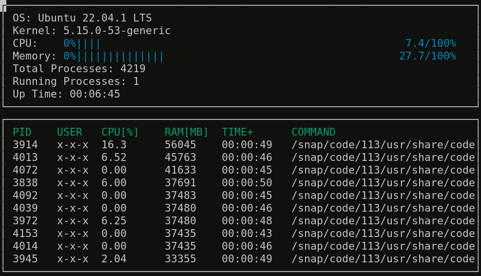
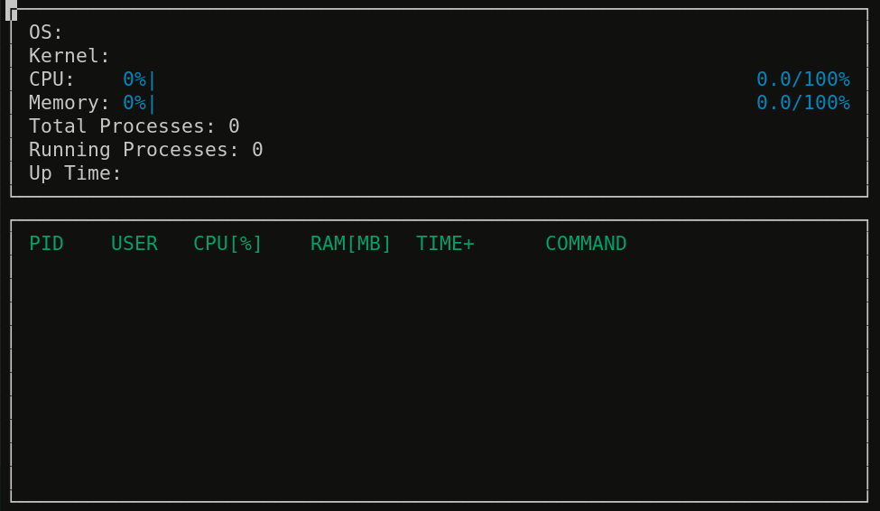
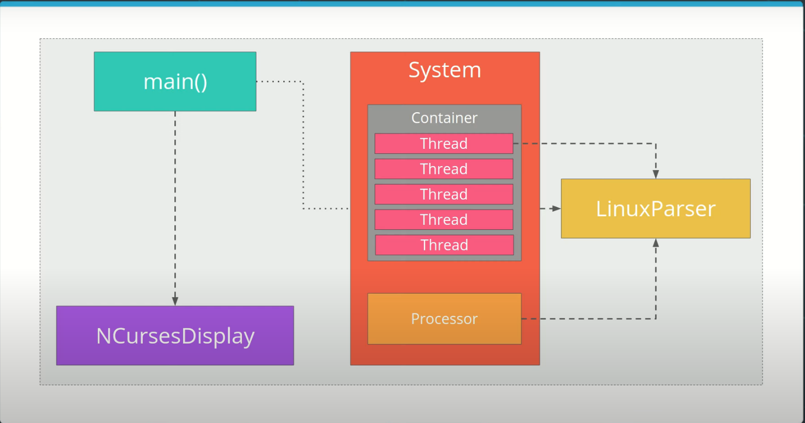

# Introduction
Linux Monitor is a text-based graphical output program to monitor system processes. Application parses [proc filesystem](https://man7.org/linux/man-pages/man5/proc.5.html) (an interface to kernel data structures) to retrieve information and format it using [ncurses](https://www.gnu.org/software/ncurses/).

## ncurses
[ncurses](https://www.gnu.org/software/ncurses/) is a library that facilitates text-based graphical output in the terminal. This project relies on ncurses for display output.

To install ncurses within your own Linux environment: `sudo apt install libncurses5-dev libncursesw5-dev`

## Make
This project uses [Make](https://www.gnu.org/software/make/). The Makefile has four targets:
* `build` compiles the source code and generates an executable
* `format` applies [ClangFormat](https://clang.llvm.org/docs/ClangFormat.html) to style the source code
* `debug` compiles the source code and generates an executable, including debugging symbols
* `clean` deletes the `build/` directory, including all of the build artifacts

## Compile and Run

1. Clone the project repository: `git clone git@github.com:compilepeace/LinuxMonitor.git` 

2. Build the project: `make build`

3. Run the resulting executable: `./build/monitor`

4. Implemented `System`, `Process`, and `Processor` classes, as well as functions within the `LinuxParser` namespace.

## Software Design

## Project Starter Code
Starter code for this repository can be found at [`https://github.com/udacity/CppND-System-Monitor-Project-Updated.git`](https://github.com/udacity/CppND-System-Monitor-Project-Updated.git). 